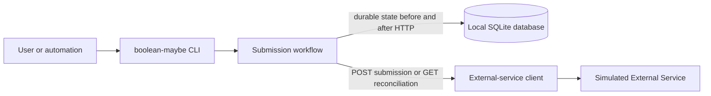

# boolean-maybe

*A resilient CLI for a deliberately unreliable job submission API.*

## How to read this repository

1. The [product brief](docs/product/product-brief.md) defines the user problem, product principles, and deliberate limits.
2. The [glossary](docs/product/glossary.md) gives uncertainty, attempts, retries, and remote evidence stable names.
3. [Core entities](docs/domain/core-entities.md) turn that language into identity, lifecycle, and compatibility contracts.
4. The [architecture overview](docs/architecture/architecture-overview.md) maps those contracts to the CLI, application workflow, SQLite persistence, HTTP adapter, and simulator.
5. The six [architecture decisions](docs/architecture/decisions/) preserve the non-obvious choices, alternatives, consequences, and system boundaries behind that map.
6. The [feature specifications](docs/specs/features/) divide the design into reviewable vertical slices with observable acceptance criteria.
7. The implementation under [`src/boolean_maybe`](src/boolean_maybe) and executable evidence under [`tests`](tests) show which contracts are present now.

## From product intent to architecture

The central design rule is simple: local state must say what the client is authorized to do before the client can produce an external side effect. A short SQLite transaction creates or resolves the Job, records a started attempt, and commits ownership metadata before the HTTP request begins. A second short transaction records authoritative success or classified failure; no database transaction remains open across network I/O.



The Job owns the local identity, canonical payload, Idempotency Key, and lifecycle state. A SubmissionAttempt is durable evidence about a particular attempt; it does not replace the Job. When dispatch may have happened but the result is unknown, the workflow asks the service about the same Idempotency Key instead of blindly posting again. If submission and reconciliation remain inconclusive, the Job becomes `AMBIGUOUS`, a terminal automatic state that preserves uncertainty rather than inventing success or failure.

## Decisions and trade-offs

- **Runtime and tooling — [ADR-001](docs/architecture/decisions/001-python-runtime-packaging-and-development-tooling.md).** Python 3.12, `uv`, a `src` layout, and a small runtime dependency set keep setup reproducible. The standard library supplies SQLite and HTTP; RFC 8785 canonicalization is the deliberate direct dependency.

- **Application boundaries — [ADR-002](docs/architecture/decisions/002-execution-model-and-application-boundaries.md).** A synchronous CLI invokes one asynchronous application workflow. Blocking SQLite and HTTP work is isolated from the event loop, while domain and persistence rules remain outside argument parsing and rendering.

- **A real local failure surface — [ADR-003](docs/architecture/decisions/003-simulated-external-service-contract.md).** The simulator is a separate loopback HTTP process with deterministic scenarios. This costs more than a mock, but exercises response loss, disconnects, status codes, and reconciliation through real sockets.

- **Durability before side effects — [ADR-004](docs/architecture/decisions/004-persistence-and-durable-consistency.md).** SQLite uses explicit short transactions, schema migrations, ownership leases, and fencing. The trade-off is more coordination metadata and conservative recovery in exchange for evidence that survives process termination.

- **Identity and duplicate prevention — [ADR-005](docs/architecture/decisions/005-identity-and-duplicate-prevention.md).** The Job ID, Idempotency Key, and Remote Request ID have separate roles. Equivalent payloads use RFC 8785 canonical bytes; a completed matching Job replays stored evidence without HTTP.

- **Bounded reliability — [ADR-006](docs/architecture/decisions/006-retry-rate-limits-ambiguity-and-recovery.md).** Retries, jitter, `Retry-After`, a shared rate-limit gate, reconciliation, and recovery all have finite budgets. The client prefers a truthful terminal ambiguity over unbounded waiting or an unsafe duplicate.

## Implementation slices

### 1. Simulated External Service

The simulator implements `POST /jobs` and `GET /jobs/by-idempotency-key/{key}`, canonical payload equivalence, idempotent replay, conflict detection, deterministic failure plans, and redacted JSON Lines operational logs. A separate real HTTP boundary catches socket and response-delivery behavior that an in-process mock would hide. Its small preset set covers `500`, `429`, timeouts, processed-without-response cases, disconnects, duplicate Remote Request IDs, and unreliable reconciliation. It is local test infrastructure, not a production API or durable remote store. See [Simulated External Service](docs/specs/features/simulated-external-service.md).

### 2. Durable single-Job happy path

The `submit` command validates one inline JSON object, resolves an Idempotency Key, initializes SQLite, records `SUBMITTING`/`STARTED` before HTTP, validates authoritative success evidence, and atomically reaches `SUCCEEDED`. Reusing a matching completed key returns the stored result without another request. See [Submit a Single Job](docs/specs/features/submit-single-job.md).

### 3. Reliability hardening

The current code hardens that same workflow rather than introducing a second path. It adds error classification, bounded submission and reconciliation budgets, jittered waits, `Retry-After`, a durable service-wide gate, restart takeover with fencing, late-observation storage, structured attempt history, and explicit operational outcomes. The target contract is complete in [Reliable Job Submission](docs/specs/features/reliable-job-submission.md), but the implementation is still partially hardened; the status table below distinguishes implemented paths from known remaining gaps.

## Current implementation status

| Capability | Status | What is available now |
| --- | --- | --- |
| Packaging and CLI bootstrap | Implemented | Python 3.12 package with `boolean-maybe` and `boolean-maybe-simulator` entry points. |
| Deterministic loopback simulator | Implemented | Submission, reconciliation, idempotent replay, conflicts, ten failure presets, and redacted JSONL logs. |
| Durable single-Job happy path | Implemented | Validation, migration v1, pre/post HTTP transactions, success, and stored replay. |
| Core retry and reconciliation flow | Partially implemented | Main `429`, proven-not-sent, uncertain-dispatch, bounded reconciliation, and ambiguity paths exist; edge-condition hardening remains. |
| Restart recovery and fencing | Partially implemented | Expired-lease takeover and late evidence exist, with remaining cancellation, timing, and evidence-consumption gaps. |
| Complete structured observation ledger | Specified | The reliability contract defines it; not every submission/reconciliation observation is yet durably and atomically represented. |
| Machine-readable command results | Implemented | Compact JSON on stdout, stable exit-code classes, attempt history, and per-invocation reconciliation count. |
| CLI structured operational logging | Deferred | The simulator logs structured events; the client CLI currently exposes result JSON and concise diagnostics, not a separate operational log stream. |
| Batch submission and bounded Batch concurrency | Deferred | The current command accepts one logical Job only. |
| Manual resolution, inspection, retention, and backup tools | Deferred | No administrative CLI is provided yet. |

## Running the project

### Prerequisites and setup

- Python 3.12
- [`uv`](https://docs.astral.sh/uv/)

```sh
uv sync --locked
```

Start the simulator in one terminal:

```sh
uv run --locked boolean-maybe-simulator
```

Submit a Job from another terminal:

```sh
uv run --locked boolean-maybe submit --job-entry '{"work":"example"}'
```

The command prints one compact JSON object. On success it includes the local Job ID, resolved Idempotency Key, state, current attempt, result evidence, `attempt_history`, and `reconciliation_requests`.

Supply a stable key when another invocation may need to continue or recover the same Job:

```sh
uv run --locked boolean-maybe submit --job-entry '{"work":"example"}' --idempotency-key job-demo
```

Run the same command again after success to receive `already_completed` from local storage without another HTTP request.

### Exercise a failure scenario

Save this as `plan.json`:

```json
{
  "version": 1,
  "rules": [
    {"operation": "submission", "idempotency_key": "job-rate-limit", "scenario": "429_then_success"}
  ]
}
```

Then start the simulator and submit with the matching key:

```sh
uv run --locked boolean-maybe-simulator --scenario-plan plan.json
uv run --locked boolean-maybe submit --job-entry '{"work":"example"}' --idempotency-key job-rate-limit
```

The default database is `.boolean-maybe/boolean-maybe.sqlite3` relative to the current directory. Use `--database PATH` to choose an explicit file and `--service-url http://127.0.0.1:PORT` for a simulator on another loopback port. The client deliberately rejects non-loopback origins.

There is no cleanup command. For disposable development state only, stop active processes and remove the explicitly selected SQLite file manually. Do not delete a database whose Job evidence you need; the application never replaces or clears it for you.

### Validate the repository

```sh
uv sync --locked
uv lock --locked
uv run --locked ruff check .
uv run --locked ruff format --check .
uv run --locked pyright
uv run --locked pytest -q
uv build
```

## Reliability model

The client first separates observations where dispatch is proven not to have started from observations where the request may have reached the service. A proven-not-sent failure can safely consume a retry attempt. A timeout, disconnect, delivered `5xx`, malformed response, or lost response is uncertain and routes to reconciliation.

Submission retries are bounded across the Job lifetime. Delays use full jitter, and a valid `Retry-After` may extend eligibility. A durable service-wide gate allows one `429` to delay other Jobs using the same database and service identity. If the required delay does not fit the invocation's wait allowance, the CLI returns a resumable outcome instead of sleeping without bound.

Reconciliation uses the original Idempotency Key. A matching processed result is authoritative success; a conflict is permanent failure; repeated inconclusive observations eventually produce `AMBIGUOUS`. Recovery follows the same rule: an expired owner may be fenced out and the new owner reconciles existing work rather than assuming the old POST never happened.

## Guarantees and non-guarantees

The project guarantees durable local authorization before a submission request, exact Idempotency Key reuse, canonical payload comparison, finite automatic work, no local replay HTTP call after recorded success, and explicit representation of unresolved uncertainty on the covered paths.

It does **not** promise exactly-once execution. It cannot prove what an external process did when both submission and reconciliation evidence are lost. It does not treat Remote Request IDs as unique, does not provide application-level database encryption or permission hardening, and does not make the in-memory simulator durable across restart. Current reliability gaps listed below also mean the complete specification is not yet a blanket implementation guarantee.

## Failure scenarios

| Scenario | Intended client behavior |
| --- | --- |
| Immediate `201` or equivalent replay `200` | Record `SUCCEEDED` and return authoritative result evidence. |
| Delivered `429` | Record retryable failure, honor bounded backoff/`Retry-After`, advance the shared gate, and retry only while eligible. |
| Connection failure proven before dispatch | Retry with the same Job identity and key within the remaining budget. |
| Timeout, disconnect, or delivered `5xx` | Do not blindly resubmit that attempt; reconcile by Idempotency Key. |
| Remote processing followed by response loss | Reconciliation records the matching remote result without creating another remote Job. |
| Submission and reconciliation both inconclusive | Transition to `AMBIGUOUS`; perform no further automatic retry. |
| Persistent `500` during reconciliation | Stop after the reconciliation budget and report `ambiguous`; do not loop indefinitely. |
| Duplicate Remote Request ID across Jobs | Keep the Jobs separate because the remote identifier is evidence, not identity. |
| Same key with a different canonical payload | Return `idempotency_conflict` without sending HTTP. |
| Matching locally completed Job | Return `already_completed` from stored evidence without sending HTTP. |
| Another live owner holds the attempt | Return `job_in_progress`; do not steal ownership or dispatch. |
| Required SQLite operation fails | Return `local_persistence_failure` and avoid claiming a remote outcome. |

## Results, logs, and exit codes

The client reserves stdout for one newline-terminated JSON result. Successful and reliability results include durable evidence where available; `submitted` describes only whether the current invocation initiated or may have initiated a submission POST. Expected errors omit payloads, raw response bodies, SQL, tracebacks, and secret-bearing headers.

| Exit code | Meaning |
| ---: | --- |
| `0` | `succeeded`, `already_completed`, or help. |
| `1` | A valid command ended in any other product or operational outcome. |
| `2` | Command syntax or pre-product validation failed. |

The simulator writes redacted JSON Lines events to stderr. The client CLI may write concise diagnostics to stderr, but separate structured operational logging for the client is deferred.

## Testing strategy

The suite works from small invariants outward: strict JSON and domain transitions; migration, schema, corruption, and transaction tests; stubbed HTTP classification; real loopback simulator integration; application workflow tests; CLI subprocess contracts; multi-process same-key races; and crash-boundary process termination. Injected clocks, random sources, sleepers, persistence faults, and HTTP adapters keep retry and timing tests deterministic without real long waits.

The repository also runs Ruff, Pyright, locked dependency checks, and package builds. Some permission and locking tests are platform-specific; skips document environments where an operating system cannot reproduce the required semantics.

## Current scope

The usable surface is deliberately narrow: one inline canonicalizable JSON object, one local SQLite database, one loopback HTTP service, and one `submit` command. There is no authentication, TLS, remote production deployment, file/stdin input, alternative rendering, arbitrary administrative access, or Batch command. The database can contain sensitive Job Entries and must be protected with filesystem permissions.

## Deferred work

| Area | Why it remains deferred |
| --- | --- |
| Complete late-observation handling | Late `429` evidence and all reconciliation categories still need the same durable gate/budget semantics as live observations. |
| Atomic structured evidence ledger | Observation recording and terminal transitions need stronger all-or-nothing crash behavior and stricter corruption validation. |
| Cancellation and timing hardening | Stage-aware cancellation, intentional-wait accounting, lease-renewal cadence, and wall-clock edge cases need broader proof. |
| Migration-chain hardening | Each historical schema version should be verified before a later migration is allowed to trust it. |
| Batch orchestration | Batch identity, input, aggregation, concurrency, and partial-result contracts require their own feature boundary. |
| Operational tooling | Inspection, manual ambiguity resolution, retention, backup, and safe maintenance commands are not designed yet. |

## What I would improve with another day

1. Make late `429` evidence advance the durable service gate and consume retry budget under the same rules as an in-band response.
2. Persist every submission and reconciliation observation together with the state transition that consumes it, then add corruption tests for the complete ledger.
3. Separate intentional wait accounting from HTTP and SQLite elapsed time, and exercise cancellation at every durable side-effect boundary.
4. Add a real multi-process shared-gate race test plus Linux and macOS CI coverage for SQLite locking and permission behavior.
5. Add a read-only inspection command before expanding into manual resolution or Batch workflows.

## Design documentation

- [Product brief](docs/product/product-brief.md)
- [Glossary](docs/product/glossary.md)
- [Core entities](docs/domain/core-entities.md)
- [Architecture overview](docs/architecture/architecture-overview.md)
- [Architecture decisions](docs/architecture/decisions/)
- [Simulated External Service specification](docs/specs/features/simulated-external-service.md)
- [Submit a Single Job specification](docs/specs/features/submit-single-job.md)
- [Reliable Job Submission specification](docs/specs/features/reliable-job-submission.md)
