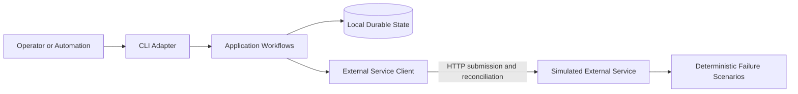
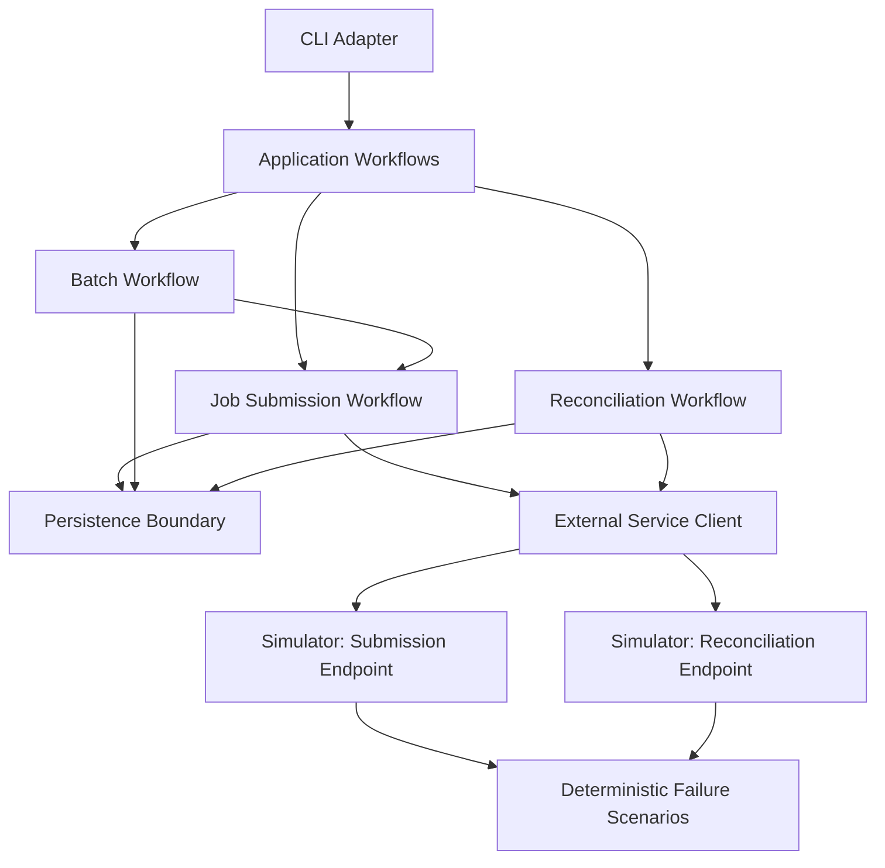
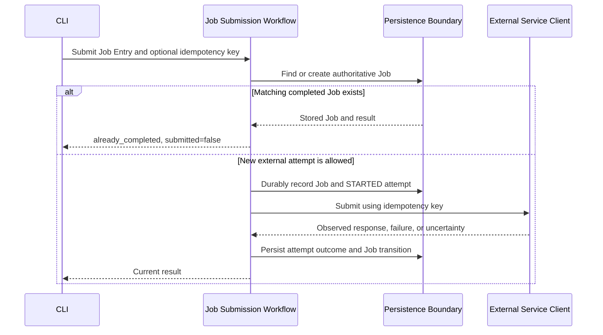

# Architecture Overview

## Purpose

This document describes the stable high-level architecture of `boolean-maybe`: its runtime boundaries, component responsibilities, dependency direction, important data flows, and ownership of authoritative state.

It intentionally does not select concrete libraries, package layouts, database schemas, class names, CLI commands, HTTP schemas, or retry formulas. Decisions at that level belong to accepted architecture decisions and approved feature specifications.

Product intent is defined in `docs/product/product-brief.md`, domain terminology in `docs/product/glossary.md`, and stable domain contracts in `docs/domain/core-entities.md`.

## System Summary

`boolean-maybe` consists of a short-lived local Python application, exposed through a CLI adapter, and a separate simulated external HTTP service. The CLI adapter accepts Job Entries and invokes application workflows. Those workflows persist authoritative local execution state and communicate with the external service through a dedicated client boundary.

The simulator exposes `POST /jobs` for idempotent submission and `GET /jobs/by-idempotency-key/{idempotency_key}` for reconciliation. It deliberately applies deterministic failure scenarios to both operations so the local application must handle retryable failures, ambiguous outcomes, process interruption, and non-authoritative remote evidence.

The local application owns Job identity and execution state. The simulator represents the unreliable external system and does not share the application's persistence or become authoritative for local identity.

## Technology Constraints

| Area | Current constraint | Deliberately undecided |
| --- | --- | --- |
| Language | Python 3.12 (CPython, `>=3.12,<3.13`); packaged with `uv` and Hatchling under a `src/boolean_maybe/` layout; formatting/linting via Ruff, static typing via Pyright, tests via pytest (see ADR-001) | Feature-level supporting libraries |
| User interface | Command-line application | Exact commands and input/output schemas |
| External integration | HTTP submission and reconciliation by idempotency key; RFC 8785 payload equivalence and evidence semantics defined by ADR-003 | Client library and feature-level wire-schema details beyond required evidence |
| Persistence | Local durable storage | Storage technology, physical schema, and consistency mechanism |
| Execution model | Synchronous CLI adapter enters one asynchronous application workflow per invocation; domain rules remain synchronous; Batch uses bounded structured concurrency (see ADR-002) | Exact Batch concurrency limit and adapter-specific non-blocking mechanisms |
| Runtime | On-demand local application process with a CLI adapter, plus a separate simulator process; the CLI is installed as the `boolean-maybe` console entry point (see ADR-001) | Simulator process launch and packaging details |

## Architectural Principles

1. **Application logic is independent of the CLI.**
   The CLI translates user input into workflow requests and renders results; it does not own submission, retry, reconciliation, or lifecycle rules.

2. **Execution boundaries are explicit.**
   The synchronous CLI adapter enters the asynchronous application once per invocation. Application workflows own I/O orchestration, while domain rules remain synchronous and independent of CLI and async infrastructure.

3. **Local state is authoritative.**
   The local application owns Job and SubmissionAttempt identity and lifecycle state. Remote responses are evidence, not replacements for local identity.

4. **Durable intent precedes possible external effects.**
   Before an external request begins, durable state identifies the Job and corresponding SubmissionAttempt and prevents recovery from treating a potentially sent request as unsent.

5. **Uncertainty remains explicit.**
   Missing or inconclusive remote evidence produces an ambiguous outcome rather than invented success or failure. `AMBIGUOUS` is never retried automatically.

6. **All submission paths use one reliability model.**
   Single-entry, batch, retry, and reconciliation flows preserve the same Job and SubmissionAttempt invariants.

7. **Batch concurrency is bounded and structured.**
   Concurrent Job workflows are limited explicitly, every task is awaited within the invocation, and expected per-Job outcomes remain isolated from sibling Jobs.

8. **The simulator remains isolated and deterministic.**
   It runs separately, owns only simulated remote behavior, and reproduces configured failure scenarios without sharing application state.

## System Context

The operator or automation interacts only with the CLI contract. The local application, through its application workflows, reads and updates local durable state and observes the simulator through HTTP. The CLI adapter does not access persistence or the simulator directly. Local durable state and simulator state are separate; neither process accesses the other's storage directly.

## Component Map

Arrows represent allowed runtime dependencies or calls. Application workflows depend on abstract persistence and external-service boundaries, not on their concrete implementations. The simulator is reached only through the external service client and has no dependency on CLI-adapter or application internals.

## Components and Responsibilities

| Component | Responsibilities | Must not own |
| --- | --- | --- |
| CLI adapter | Parse inputs, synchronously enter one top-level asynchronous application workflow, and render machine-readable results and documented exit codes. | Event-loop orchestration beyond the single application entry, Job lifecycle rules, retry decisions, persistence operations, or HTTP reliability behavior. |
| Application workflows | Asynchronously coordinate use cases and enforce domain contracts across persistence and external interactions. | Transport-specific presentation, physical storage details, or independent domain state. |
| Job submission workflow | Resolve idempotency identity, detect existing Jobs, create and complete SubmissionAttempts, classify observed outcomes, and apply bounded retry semantics. | CLI formatting, batch-specific state, or simulator scenario control. |
| Batch workflow | Accept multiple Job Entries, coordinate bounded structured execution of the single-Job submission workflow, preserve Job isolation, and produce aggregate reporting. | Unbounded or fire-and-forget tasks, a separate submission/retry model, or authority over Job state. |
| Reconciliation workflow | Query external evidence by idempotency key and apply only explicit, auditable resolutions allowed by an approved specification. | Implicit retries from `AMBIGUOUS` or unverified reclassification. |
| Persistence boundary | Durably store and retrieve authoritative local state while preserving required identity, lifecycle, and consistency guarantees. | Independent domain transitions or external HTTP behavior. |
| External service client | Translate workflow requests and remote observations across the HTTP boundary without assigning stronger certainty than the evidence supports. | Local identity, Job lifecycle decisions, or retry policy ownership. |
| Simulated external service | Bind idempotency keys to RFC 8785-equivalent Job Entries, provide idempotent `POST /jobs` and reconciliation `GET /jobs/by-idempotency-key/{idempotency_key}`, and execute deterministic unreliable behaviors for both operations. | Local Job identity, local execution state, CLI behavior, application persistence, or scenario outcomes that contradict actual key binding. |

## Dependency Direction and Boundaries

The CLI depends on application workflows. It may not call persistence or the simulator directly.

Application workflows depend on the stable domain contracts and on abstract persistence and external-service boundaries. Concrete storage and HTTP details remain outside workflow logic.

The CLI creates one event-loop lifecycle per invocation and crosses into the asynchronous application exactly once. Domain rules remain synchronous; potentially long infrastructure I/O must not block the application event loop.

The Batch workflow delegates each eligible Job to the Job submission workflow. Reconciliation is a separate explicit workflow and cannot silently become a retry path.

The persistence implementation and external service client adapt infrastructure to the needs of the workflows. They do not define domain state transitions.

The simulator is an independently running process behind HTTP endpoints. It does not import, call, or share storage with the local application.

## Important Data Flows

### Job Submission

The persistence consistency mechanism is deliberately unspecified. Its observable guarantee is that recovery cannot mistake a potentially sent request for one that was never sent.

This sequence is a simplified happy-path boundary view. It does not enumerate every state-dependent outcome, including an existing `SUBMITTING` or `AMBIGUOUS` Job or a `RETRY_SCHEDULED` Job that has not reached its eligibility time.

### Batch Orchestration

The CLI passes multiple Job Entries to the Batch workflow. The workflow resolves each entry to a Job and delegates eligible work to the Job submission workflow. Each Job retains independent authoritative state; failure or ambiguity of one Job cannot alter another Job. Whether Batch itself is persisted and how membership or aggregate results are represented remain deferred decisions.

### Reconciliation

The CLI explicitly invokes the reconciliation workflow for an eligible Job. The workflow reads local state, queries the simulator by idempotency key through the external service client, and records only conclusions supported by observed evidence. A delivered `200 processed` response is authoritative positive evidence only when its key and canonical payload digest match the local Job Entry. A digest mismatch proves a key conflict, not local success. A `404 not_found` response is only a point-in-time negative observation and cannot by itself authorize automatic retry. Because reconciliation is also unreliable, an inconclusive operation preserves ambiguity rather than triggering an implicit submission or inventing a definitive outcome.

### Simulator Contract and Failure Evidence

The first processed submission atomically binds an idempotency key to the RFC 8785 canonical bytes of its complete Job Entry. An equivalent replay returns the stored result without processing again; a non-equivalent reuse returns `409 Conflict` without changing the binding. A SHA-256 canonical payload digest may be exchanged as comparison evidence but is not local identity or a security boundary.

Delivered successful submission or matching `200 processed` reconciliation is definitive positive processing evidence. Delivered `400`, `409`, and `429` responses definitively describe rejection, conflict, or rate limiting for that request. A reconciliation `404`, remote request ID alone, `5xx`, incomplete response, timeout, or disconnect cannot establish a definitive remote outcome. The same `5xx`, timeout, or disconnect may occur before or after remote processing.

Failure scenarios are selected by a simulator-owned deterministic plan using operation, exact key or wildcard, and per-operation/per-key request ordinal. Exact-key entries take precedence over wildcard entries. Per-key serialization preserves deterministic behavior under concurrent Batch execution. Scenario controls remain outside Job Entry and product-facing request fields and cannot override actual idempotency binding or payload equivalence.

### Recovery After Interruption

A later CLI invocation triggers an application workflow that reads authoritative local state through the persistence boundary. A Job left in `SUBMITTING` cannot become eligible for another external request unless evidence and an approved recovery policy safely exclude prior remote processing. The concrete recovery algorithm is deferred to an ADR and feature specification.

## Data and State Ownership

| Data or state | Authority | Architectural rule |
| --- | --- | --- |
| Job and execution state | Local application through the persistence boundary | Authoritative for local identity and lifecycle. |
| SubmissionAttempt history | Local application through the persistence boundary | Recorded before a possible side effect and append-oriented after completion. |
| Job Entry | Job | Immutable after Job creation. |
| Idempotency key | Job | Generated by the application workflow when not supplied by the user; never derived from payload. |
| Remote request ID and remote responses | External service, stored locally as evidence | Optional, potentially duplicated, and never authoritative local identity. |
| Simulator processing state | Simulated external service | Keyed by idempotency key, binds one canonical Job Entry to one processed result, and is accessible only through submission and reconciliation operations. Its reset or retention boundary limits the duration of available evidence. |
| Batch data | Undecided | Candidate domain concept; persistence and cardinality require later approval. |

## Runtime and Deployment Model

The system has two local runtime units:

1. The local application runs on demand through its synchronous CLI adapter. Each invocation creates one event-loop lifecycle, awaits one top-level asynchronous application workflow, emits its result, and exits. No application task may outlive the invocation, and reliability cannot depend on the process remaining alive.
2. The simulated external service runs as a separate HTTP process and retains enough simulated remote state to support idempotent submission and reconciliation by idempotency key.

The repository must remain runnable without external infrastructure. Hosting, process supervision, local storage technology, and simulator process packaging are not selected by this overview.

## Security and Privacy Boundary

The current product targets a trusted local development or evaluation environment; authentication and authorization are outside scope.

Job payloads may contain sensitive user data. Full payloads do not cross into operational logs by default, SubmissionAttempt records do not duplicate raw payloads, and stored error or response information must not expose secrets. The simulator receives Job Entry data only through its HTTP submission boundary and must not gain access to local persistence.

## Architectural Constraints

* Preserve the separation between CLI presentation and application/domain behavior.
* Enter the asynchronous application exactly once from the synchronous CLI adapter; do not leak CLI-framework or event-loop concerns into domain interfaces.
* Do not bypass the Job submission workflow from batch orchestration.
* Do not create unbounded or fire-and-forget Batch tasks; await all owned tasks before the invocation exits.
* Preserve expected per-Job failure and ambiguity as isolated results rather than allowing them to cancel sibling Jobs.
* Propagate unexpected cancellation after required cleanup and durable-state handling; do not silently swallow cancellation.
* Do not let persistence or HTTP adapters introduce independent lifecycle transitions.
* Do not share storage between the application and simulator.
* Do not use remote request IDs as local identities or uniqueness keys.
* Do not infer safe retry from reconciliation `404`, a remote request ID, or other non-authoritative evidence.
* Do not let simulator scenario controls override actual idempotency binding or payload-equivalence semantics.
* Do not send an external request before the required durable Job and SubmissionAttempt state exists.
* Do not automatically retry `AMBIGUOUS` Jobs or treat reconciliation as an implicit retry.
* Do not claim exactly-once remote processing; unreliable idempotency and reconciliation reduce duplicate risk but do not eliminate uncertainty.
* Keep persistence technology, physical schemas, package layout, CLI surface, and retry formulas outside this overview until approved separately.

## Known Risks and Trade-offs

* A short-lived CLI must recover from durable evidence rather than in-memory coordination.
* The external service may process a request without returning a usable response, so some outcomes remain ambiguous even with idempotency and reconciliation capabilities.
* Unreliable reconciliation may preserve ambiguity instead of resolving it.
* Local-only persistence avoids external infrastructure but does not provide distributed coordination or high availability.
* Keeping Batch as a candidate concept avoids premature persistence commitments but defers parts of batch recovery and reporting design.
* Deterministic simulator scenarios improve repeatability but cannot reproduce every failure mode of a real external service.

## Deferred Architecture Decisions

The following questions require ADRs before affected features are implemented:

* Which local persistence technology is used, and how does it implement the durable consistency boundary between Job state, SubmissionAttempt state, and possible external effects?
* What recovery algorithm evaluates Jobs and attempts left in progress after interruption?
* What timeout, retry-budget, rate-limit, and retry-exhaustion policies govern external operations?
* Is Batch persisted, and if so, what are its identity, membership, cardinality, lifecycle, and aggregate-state semantics?
* What retention and deletion rules apply to authoritative local history and simulator state?

Exact CLI commands, input methods, response schemas, the positive Batch concurrency limit and its user-facing configurability, Batch ordering and duplicate presentation, and explicit user operations from `AMBIGUOUS` belong to approved feature specifications rather than this overview.

## Related Architecture Decisions

* `docs/architecture/decisions/001-python-runtime-packaging-and-development-tooling.md` — Python runtime, packaging, and development tooling baseline.
* `docs/architecture/decisions/002-execution-model-and-application-boundaries.md` — synchronous CLI boundary, asynchronous application workflows, and bounded structured Batch concurrency.
* `docs/architecture/decisions/003-simulated-external-service-contract.md` — simulator endpoints, idempotency and payload-equivalence rules, reconciliation evidence, and deterministic failure scenarios.
