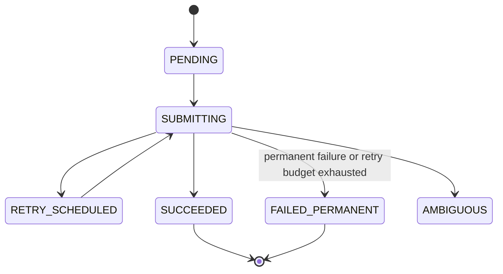
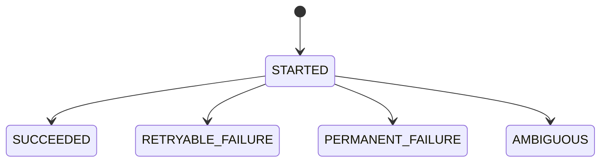

# Core Entities

## Purpose

This document defines the stable domain entities and data contracts used across `boolean-maybe`.

It describes entity identity, fields, relationships, lifecycle states, invariants, ownership, and compatibility expectations, and explicitly marks domain concepts whose core-entity status remains a candidate. It does not define the physical database schema, Python models, HTTP payloads, or CLI response schemas.

Product intent is defined in:

```text
docs/product/product-brief.md
```

Domain terminology is defined in:

```text
docs/product/glossary.md
```

Architecture and implementation-specific data models must remain consistent with this document.

## Shared Conventions

* Entity identifiers are opaque strings generated by the local application.
* Timestamps represent UTC instants.
* Stored timestamps must preserve sufficient precision to order lifecycle events.
* Enum values are written in uppercase in specifications and code.
* Optional fields use `null` when no value is known.
* Remote identifiers are external evidence and are never authoritative local identities.
* Before an external request begins, durable state must identify the `Job` and corresponding `SubmissionAttempt` and must prevent recovery from treating a potentially sent request as unsent. The architecture defines how this consistency boundary is implemented.

## Entity Overview

| Entity              | Purpose                                                                                          | Domain Responsibility | Notes                                         |
| ------------------- | ------------------------------------------------------------------------------------------------ | --------------------- | --------------------------------------------- |
| `Job`               | Represents one authoritative local logical submission and its current execution state.           | Application           | Authoritative local unit of work.             |
| `SubmissionAttempt` | Records one delivery attempt that may result in one HTTP interaction while submitting a Job.      | Submission workflow   | Append-oriented history belonging to one Job. |

The following glossary concepts are not separate core entities:

* `Job Entry` is an immutable user-provided JSON object stored as part of a `Job`.
* `Execution State` is represented by the `Job.state` field.
* `Remote Request ID` is optional evidence stored on a `SubmissionAttempt`.
* `Structured Log` is an operational event, not a persisted domain entity.
* `Submission` is the logical delivery represented by a `Job` and its `SubmissionAttempt` history. It is not a separate core entity in the current model.
* `Retry` is a lifecycle action resulting in another `SubmissionAttempt`.

`Batch` remains a candidate core entity pending approved architecture decisions and a Batch feature specification.

---

## Entity: Job

### Purpose

`Job` represents one authoritative local unit of work and its logical submission managed by the CLI.

It preserves the original Job Entry, its local identity, duplicate-prevention identity, current execution state, and relationship to all submission attempts.

A Job exists independently of whether the external service receives or processes it.

### Fields

| Field             | Type          | Required | Description                                      | Invariants                    |
| ----------------- | ------------- | -------: | ------------------------------------------------ | ----------------------------- |
| `job_id`          | `string`      |      Yes | Locally generated stable identifier.             | Unique and immutable.         |
| `idempotency_key` | `string`      |      Yes | Stable key identifying the logical submission.   | Unique locally and immutable. |
| `payload`         | `JSON object` |      Yes | Job Entry supplied by the user.                  | Immutable after creation.     |
| `state`           | `enum`        |      Yes | Current lifecycle state of the Job.              | Must be an allowed Job state. |
| `created_at`      | `datetime`    |      Yes | Time at which the Job was created locally.       | Immutable.                    |
| `updated_at`      | `datetime`    |      Yes | Time of the latest persisted state change.       | Must not precede `created_at`. |

The exact feature-specific schema of `payload` is defined by the applicable approved feature specification.

### Identity

A Job is identified by `job_id`.

`job_id` is generated locally and never changes.

`idempotency_key` is an additional unique logical identity used for duplicate prevention. The application workflow generates a key when the user does not provide one, and a user-provided key is preserved. The key must never be derived from the Job Entry payload. Reusing an `idempotency_key` for a non-equivalent Job Entry must be rejected before an external request begins.

Two Job Entries are equivalent when their complete JSON objects produce identical UTF-8 canonical bytes under RFC 8785, including its I-JSON constraints and verified errata. Object member order and insignificant serialization whitespace do not affect equivalence; array order and distinctions preserved by RFC 8785 do. Input that cannot be represented canonically must be rejected before external processing.

An approved design may compute or persist a SHA-256 digest of the canonical bytes as comparison evidence. Such a digest is derived operational metadata, not authoritative identity or a security boundary, and is not a required `Job` or `SubmissionAttempt` field.

A `remote_request_id` must never replace `job_id` or `idempotency_key`.

### Allowed States

| State              | Meaning                                                                          |     Automatic submission allowed |
| ------------------ | -------------------------------------------------------------------------------- | -------------------------------: |
| `PENDING`          | The Job is persisted and ready for its first attempt.                            |                              Yes |
| `SUBMITTING`       | An attempt has started and an external side effect may occur.                    |                               No |
| `RETRY_SCHEDULED`  | A retryable failure occurred and another attempt is scheduled.                   |  Yes, after its eligibility time |
| `SUCCEEDED`        | The external service definitively accepted or processed the Job.                 |                               No |
| `FAILED_PERMANENT` | The Job reached a definitive failure or exhausted its bounded retry policy.      |                               No |
| `AMBIGUOUS`        | The application cannot determine whether the external service processed the Job. |                               No |

### Lifecycle



`AMBIGUOUS` is terminal for automatic processing.

While a Job is `SUBMITTING`, no additional concurrent attempt may begin. A `PERMANENT_FAILURE` SubmissionAttempt transitions its Job to `FAILED_PERMANENT`. A `RETRYABLE_FAILURE` transitions the Job to `RETRY_SCHEDULED` only while the three-SubmissionAttempt lifetime budget from ADR-006 permits another attempt; when the budget is exhausted, the Job transitions to `FAILED_PERMANENT`.

A future approved feature specification may define explicit reconciliation, manual resolution, or user-approved retry transitions from `AMBIGUOUS`. No such transition may occur implicitly.

A Job found in `SUBMITTING` after an unexpected process interruption must be treated conservatively. Recovery must not make the Job automatically eligible for another external request unless available evidence and the approved recovery policy safely exclude prior remote processing. `AMBIGUOUS` is the safe outcome when remote processing cannot be excluded. The recovery algorithm is defined by an applicable ADR and approved feature specification.

### Relationships

| Relationship                | Type         | Rule                                                                                     |
| --------------------------- | ------------ | ---------------------------------------------------------------------------------------- |
| `Job` → `SubmissionAttempt` | one-to-many | A Job may have zero or more attempts. Every attempt belongs to exactly one Job. |

Any relationship between `Job` and the candidate `Batch` concept is defined by an approved Batch feature specification.

### Ownership

The application owns the following Job responsibilities:

* Job creation;
* duplicate detection;
* validation of identity and payload consistency;
* state transitions;
* retry scheduling;
* finalization.

Persistence mechanisms may store and retrieve Jobs but must not introduce independent state transitions. The submission workflow may request a transition but must apply it through the domain rules that own Job state.

### Validation and Invariants

* `job_id` must be unique.
* `idempotency_key` must be unique within the local persistence store.
* `payload` must be a JSON object and must not change after Job creation.
* Job Entry equivalence must use RFC 8785 canonical-byte equality.
* Reusing an `idempotency_key` for a non-equivalent Job Entry must be rejected before an external request begins.
* A request matching an existing completed Job must return that Job without creating another SubmissionAttempt or initiating another external request.
* A Job may have at most one `STARTED` SubmissionAttempt at a time.
* Before an external request begins, durable state must identify the Job and corresponding SubmissionAttempt and prevent recovery from treating a potentially sent request as unsent.
* A Job in `RETRY_SCHEDULED` derives its authoritative earliest eligibility from its most recent `RETRYABLE_FAILURE` SubmissionAttempt as `completed_at + retry_after_ms`.
* `SUCCEEDED` and `FAILED_PERMANENT` must not transition automatically to another state.
* `AMBIGUOUS` must not be retried automatically.
* Duplicate remote request IDs must not merge, overwrite, or re-identify Jobs.

### Compatibility

Backward-compatible changes include:

* adding an optional field with a safe default;
* adding non-authoritative diagnostic metadata;
* adding a new state only when all consumers safely handle unknown states.

Breaking changes include:

* changing Job identity rules;
* allowing mutation of `payload` or `idempotency_key`;
* changing the meaning of an existing state;
* changing terminal-state behavior;
* removing or renaming a required field;
* changing the type of a stable field;
* weakening duplicate-prevention invariants.

### Security and Privacy

Job payloads may contain sensitive or user-provided data.

* Full payloads must not be written to operational logs by default.
* Error messages must not expose payload content unnecessarily.
* Any canonical payload digest introduced by an approved design must be treated as operational metadata, not as authoritative identity or a security boundary.
* Authentication, authorization, and payload encryption are outside the current product scope.

### Related Documents

```text
docs/product/product-brief.md
docs/product/glossary.md
docs/architecture/architecture-overview.md
docs/architecture/decisions/003-simulated-external-service-contract.md
```

---

## Entity: SubmissionAttempt

### Purpose

`SubmissionAttempt` records one delivery attempt that may result in one HTTP interaction while trying to submit a Job.

Multiple attempts may belong to the same logical submission. An attempt records what the application observed without claiming more certainty than the external interaction provides.

### Fields

| Field               | Type       | Required | Description                                                  | Invariants                                       |
| ------------------- | ---------- | -------: | ------------------------------------------------------------ | ------------------------------------------------ |
| `attempt_id`        | `string`   |      Yes | Stable locally generated attempt identifier.                 | Unique and immutable.                            |
| `job_id`            | `string`   |      Yes | Identifier of the owning Job.                                | Must reference an existing Job.                  |
| `attempt_number`    | `integer`  |      Yes | Monotonically increasing attempt number within the Job.      | Positive and unique per Job.                     |
| `state`             | `enum`     |      Yes | Current or final attempt outcome.                            | Must be an allowed attempt state.                |
| `started_at`        | `datetime` |      Yes | Time at which the attempt was durably started.               | Immutable.                                       |
| `completed_at`      | `datetime` |       No | Time at which a final attempt outcome was recorded.          | Required for every state except `STARTED`.       |
| `http_status`       | `integer`  |       No | HTTP response status received from the external service.     | Present only when an HTTP response was received. |
| `remote_request_id` | `string`   |       No | Request identifier returned by the external service.         | Not required to be unique.                       |
| `error_category`    | `string`   |       No | Stable machine-readable classification of a failure.         | Must not contain raw secrets or payload data.    |
| `retry_after_ms`    | `integer`  |       No | Effective interval from attempt completion to retry eligibility. | Required when `RETRYABLE_FAILURE` transitions the Job to `RETRY_SCHEDULED`; non-negative. |

### Identity

A SubmissionAttempt is identified by `attempt_id`.

The pair of `job_id` and `attempt_number` must also be unique.

`remote_request_id` is neither a local identity nor a uniqueness key. Multiple attempts or unrelated Jobs may contain the same remote request ID.

### Allowed States

| State               | Meaning                                                                                           |
| ------------------- | ------------------------------------------------------------------------------------------------- |
| `STARTED`           | The attempt has been durably recorded and may exist before, initiate, or already have initiated an external request. |
| `SUCCEEDED`         | A definitive successful response was observed.                                                    |
| `RETRYABLE_FAILURE` | The attempt failed in a way that may permit another attempt.                                      |
| `PERMANENT_FAILURE` | The attempt produced a definitive failure that must not be retried automatically.                 |
| `AMBIGUOUS`         | The attempt may have been processed remotely, but no definitive outcome was observed.             |

### Lifecycle



A completed attempt is append-only and must not later be reclassified silently.

Reclassification must be explicit and auditable through a mechanism defined by an approved specification.

### Relationships

| Relationship                | Type        | Rule                                              |
| --------------------------- | ----------- | ------------------------------------------------- |
| `SubmissionAttempt` → `Job` | many-to-one | The Job must exist before the attempt is created. |

### Ownership

The submission workflow owns creation and completion of SubmissionAttempts. The application owns the resulting Job state transition.

Before an external request begins, durable state must identify the Job and corresponding SubmissionAttempt and must prevent recovery from treating a potentially sent request as unsent. The architecture defines how this consistency boundary is implemented.

### Validation and Invariants

* `attempt_id` must be unique.
* `attempt_number` must be positive and unique within its Job.
* Attempt numbers must increase monotonically for each Job.
* Only one attempt for a Job may remain in `STARTED`.
* `started_at` must not change.
* `completed_at` must not precede `started_at`.
* `completed_at` is required once the attempt leaves `STARTED`.
* `retry_after_ms` is required and non-negative when a `RETRYABLE_FAILURE` transitions its Job to `RETRY_SCHEDULED`.
* For that transition, authoritative Job retry eligibility is `completed_at + retry_after_ms`; a duplicate authoritative Job-level eligibility field must not be introduced without an approved core-entity change.
* A budget-exhausting `RETRYABLE_FAILURE` may retain `retry_after_ms` as diagnostic evidence but creates no retry eligibility.
* `remote_request_id` must not have a uniqueness constraint.
* An attempt outcome must accurately represent observed evidence.
* A disconnect or timeout after the request may have reached the service must not be classified as a definitive remote failure without additional evidence.
* Completed attempts must remain available for diagnostics and recovery during the configured retention period.

### Compatibility

Backward-compatible changes include:

* adding optional diagnostic fields;
* adding new error categories with an unknown-category fallback;
* adding optional external-response metadata.

Breaking changes include:

* changing attempt identity or numbering rules;
* changing the meaning of an existing state;
* permitting completed attempts to be overwritten;
* making `remote_request_id` authoritative or unique;
* removing timestamps required for recovery and diagnostics.

### Security and Privacy

* Raw request payloads must not be duplicated into SubmissionAttempt records.
* Stored error information must be sanitized.
* HTTP headers containing credentials or secrets must not be persisted.
* Remote response bodies must not be stored unless an approved feature specification defines a safe schema and retention policy.

### Related Documents

```text
docs/product/product-brief.md
docs/product/glossary.md
docs/architecture/architecture-overview.md
```

---

## Candidate Core Entity: Batch

`Batch` represents one multi-entry CLI operation. It accepts multiple Job Entries and associates the resulting Jobs for aggregate reporting.

Each Job retains an independent and authoritative lifecycle state. Batch orchestration must not override or replace Job state and must use the same single-Job submission workflow. Failure or ambiguity of one Job must not corrupt another Job.

Whether Batch is persisted, its fields and lifecycle, resume behavior, input ordering, duplicate-entry behavior, aggregate snapshot fields, membership storage, relationship cardinality with Job, and whether one Job may participate in multiple Batches remain open for architecture decisions and an approved Batch feature specification.

---

## Open Questions

`docs/specs/features/submit-single-job.md` narrows three of these for the single-Job `submit` command: the first Job Entry payload is any canonicalizable JSON object with no required or optional fields, the accepted `idempotency_key` grammar is 1-128 characters from `A-Z a-z 0-9 . _ ~ -`, and inline JSON is the only supported input method for that command. Later features may still add required payload fields or additional CLI input methods.

The following questions must be resolved before implementation of the affected features:

1. Which explicit operations, if any, may transition a Job out of `AMBIGUOUS`?
2. Is Batch persisted, and what identity, fields, states, resume lifecycle, membership storage, and Job cardinality does it require?
3. Should Batch processing preserve original input ordering, and how should duplicate entries be represented?
4. Are aggregate Batch results derived at read time or persisted as snapshots?
5. What retention or deletion policy applies to Jobs, SubmissionAttempts, and any persisted Batch data?
