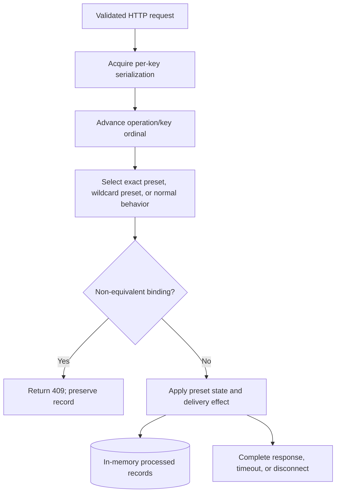

# Feature Specification: Simulated External Service

## Status

Implemented

## Summary

Implement a small, separately running HTTP simulator that provides idempotent Job Entry submission, reconciliation by idempotency key, deterministic failure presets, minimal structured operational logs, and a documented local startup workflow. The simulator exists only to exercise the CLI reliability contract and does not become a general-purpose test platform or a second authority for local Job state.

## References / Context

* `docs/product/product-brief.md`
* `docs/product/glossary.md`
* `docs/domain/core-entities.md`
* `docs/architecture/architecture-overview.md`
* `docs/architecture/decisions/001-python-runtime-packaging-and-development-tooling.md`
* `docs/architecture/decisions/002-execution-model-and-application-boundaries.md`
* `docs/architecture/decisions/003-simulated-external-service-contract.md`
* `docs/architecture/decisions/005-identity-and-duplicate-prevention.md`
* `docs/architecture/decisions/006-retry-rate-limits-ambiguity-and-recovery.md`
* [RFC 8785: JSON Canonicalization Scheme](https://www.rfc-editor.org/info/rfc8785/)
* [`rfc8785` package on PyPI](https://pypi.org/project/rfc8785/)

## Problem

The CLI reliability workflows need a reproducible external HTTP boundary that can process idempotent submissions, expose reconciliation evidence, and fail before or after processing. Without the simulator, tests cannot demonstrate the distinction between definitive rejection, safe replay, rate limiting, transport uncertainty, processed-without-response behavior, or duplicate remote request IDs.

The simulator must expose enough controlled unreliability for those tests while remaining easy to run, deterministic, local, and intentionally narrow.

## Goal

Provide an installable local simulator process whose public HTTP behavior and deterministic scenario controls are sufficient for later external-client, submission, retry, and reconciliation feature tests without adding unrelated infrastructure or product behavior.

## Non-goals

* Implement the product CLI submission, retry, persistence, Batch, or recovery workflows.
* Provide a browser UI, remote administration API, scenario editor, plugin system, arbitrary scripted faults, or random fault injection.
* Provide authentication, authorization, TLS termination, deployment manifests, service discovery, or non-local hosting.
* Persist simulator processing state or scenario counters across process restarts.
* Guarantee exactly-once processing beyond the lifetime of one simulator process.
* Emulate production scale, distributed coordination, high availability, or realistic network topology.
* Add a general-purpose web framework, ORM, database, or logging framework.
* Let product request payloads or headers select failure scenarios.

## Users / Actors

* A developer or reviewer starting the simulator locally.
* The future external service client sending submission and reconciliation requests.
* Automated contract and integration tests.

## Scope

In scope:

* `POST /jobs` submission.
* `GET /jobs/by-idempotency-key/{idempotency_key}` reconciliation.
* RFC 8785 Job Entry equivalence and SHA-256 payload evidence.
* In-memory idempotency binding and stored-result replay.
* Startup-time deterministic scenario configuration.
* The required named failure presets.
* Duplicate remote request IDs.
* Per-operation/per-key request ordinals and same-key serialization.
* Minimal JSON Lines operational logs.
* A separate installed simulator command and local setup/run documentation.
* Automated contract, concurrency, configuration, startup, and packaging tests.

Out of scope:

* Any endpoint other than the two product-facing endpoints above.
* Runtime mutation or inspection of scenario configuration through HTTP.
* Runtime state reset without restarting the process.
* Physical persistence, retention configuration, migrations, or backups.
* Client-side interpretation of responses or scenario names.
* Changes to Job or SubmissionAttempt core entities.

## Expected Behavior

### Runtime process

The installed package exposes a second synchronous console entry point:

```text
boolean-maybe-simulator = "boolean_maybe.simulator.cli:main"
```

The command syntax is:

```text
boolean-maybe-simulator [--host 127.0.0.1] [--port 8080] [--scenario-plan PATH]
```

Rules:

* `--host` defaults to `127.0.0.1` and accepts only an IP literal for which Python's `ipaddress.ip_address(value).is_loopback` is true. This includes IPv4 `127.0.0.0/8` and IPv6 `::1`; hostnames such as `localhost` are rejected.
* `--port` defaults to `8080` and accepts an integer from 1 through 65535.
* `--scenario-plan` is optional. When omitted, the simulator has no rules and every request uses normal state-dependent behavior.
* The simulator reads and validates the complete plan before binding the socket. Invalid arguments or configuration produce a concise stderr message and exit code `2` without starting the server.
* A bind or unexpected startup failure exits with code `1`.
* A clean `Ctrl+C`/SIGINT shutdown exits with code `0` and discards all in-memory state.
* The simulator is a separate process and never imports or accesses application persistence.

Implementation uses the Python standard-library HTTP server facilities with at most 32 active request-handler threads, enforced by a fixed non-configurable bound implemented above the standard unbounded threading mix-in. No web framework is introduced. Different idempotency keys may be handled concurrently; submission and reconciliation operations for the same key are serialized through shared per-key coordination.

On clean shutdown, the server stops accepting connections, signals the injectable timeout waiter, closes active request sockets, and waits at most two seconds for request handlers to finish. Handler threads must not keep the process alive after that bound. Timeout-style handlers interrupted by shutdown emit one complete `request_aborted` event; `simulator_stopped` is emitted last. Subprocess tests use the platform-appropriate interrupt mechanism—POSIX SIGINT or a Windows console control event/process-group setup—and always retain a forced-termination cleanup fallback.

### Dependency change

Add one direct runtime dependency:

```toml
dependencies = ["rfc8785>=0.1.4,<0.2"]
```

The dependency is required because Python's standard JSON serializer does not implement the ECMAScript number and string serialization rules required by RFC 8785. It is used directly for canonicalization, supports Python 3.12, is pure Python, and adds no transitive runtime dependencies. `pyproject.toml` and `uv.lock` must be updated together. No other runtime or development dependency is added.

### Idempotency key validation

An accepted idempotency key:

* is 1 through 128 ASCII characters;
* contains only `A-Z`, `a-z`, `0-9`, `.`, `_`, `~`, or `-`;
* is compared exactly and is never trimmed, case-folded, decoded twice, or otherwise normalized.

The `Idempotency-Key` submission header carries the exact value. Reconciliation uses the percent-encoded UTF-8 representation of that same value as one path segment. Strict percent decoding must recover exactly one accepted key; invalid escapes, invalid UTF-8, decoded separators, or a value outside the accepted grammar produce `400 invalid_idempotency_key`.

The `*` character is not an accepted product key and is reserved for wildcard rules in the scenario plan.

### Request parsing

`POST /jobs` requires:

* exactly one `Idempotency-Key` header;
* `Content-Type: application/json`, optionally with `charset=utf-8`;
* a valid decimal `Content-Length` no greater than 1 MiB;
* one UTF-8 JSON document whose root is an object;
* no duplicate member names at any nesting level;
* input accepted by RFC 8785, including its I-JSON constraints.

`POST /jobs` rejects any `Transfer-Encoding` header, including `chunked`, with `400 invalid_request`. A missing, repeated, negative, non-decimal, or otherwise malformed `Content-Length` also returns `400 invalid_request`. Malformed UTF-8/JSON, duplicate members, a non-object root, or non-canonicalizable input returns `400 invalid_request`. A declared body above 1 MiB returns `413 payload_too_large`; an unsupported content type returns `415 unsupported_media_type`. These failures do not consume a scenario ordinal and never create processing state.

`GET /jobs/by-idempotency-key/{idempotency_key}` has no request body. Any `Transfer-Encoding` header; repeated, negative, non-decimal, or malformed `Content-Length`; or a valid `Content-Length` other than `0` returns `400 invalid_request`. Absent `Content-Length` and `Content-Length: 0` are accepted. An invalid path/key returns `400 invalid_idempotency_key`. Unknown routes return `404 route_not_found`; unsupported methods on a known route return `405 method_not_allowed` with an `Allow` header.

When one request has multiple faults, response selection follows this order: route and method, HTTP body framing and size, content type, idempotency key, then JSON/canonicalization validation. Only the first applicable error is returned. No validation failure consumes an ordinal.

All complete JSON responses use UTF-8, `Content-Type: application/json`, and an accurate `Content-Length`. Redirects are never emitted.

### Payload equivalence and processed records

Before calling `rfc8785.dumps()`, the simulator explicitly validates the parsed tree for required I-JSON constraints, including finite numbers, integers in the interoperable exact range `[-(2^53)+1, (2^53)-1]`, valid Unicode scalar values, and duplicate-member rejection already performed during parsing. Library rejection remains a validation failure rather than an internal error. The simulator canonicalizes the complete Job Entry with RFC 8785. Two entries are equivalent only when their canonical UTF-8 bytes are identical.

The payload digest is:

```text
sha256:<64 lowercase hexadecimal SHA-256 characters>
```

One in-memory processed record contains:

* the exact idempotency key;
* canonical Job Entry bytes;
* payload digest;
* stored remote request ID;
* the immutable processed result.

The record is created atomically at most once per key. It becomes immediately visible to reconciliation when committed; there is no eventual-consistency delay. State is retained only until simulator shutdown.

Normal remote request IDs are deterministic:

```text
remote-<first 24 lowercase hex characters of SHA-256(UTF-8 idempotency key)>
```

The `duplicate_remote_request_id` preset instead stores the exact value `remote-duplicate` for every newly processed key using that preset. Remote request IDs are not unique and do not affect key binding.

### Submission responses

For a new key processed normally, return `201 Created`:

```json
{
  "idempotency_key": "job-a",
  "status": "processed",
  "payload_digest": "sha256:<digest>",
  "remote_request_id": "remote-<value>",
  "replayed": false
}
```

For an equivalent replay, return `200 OK` with the stored result and `replayed: true`. Replay never creates a new processed record or remote request ID.

For a key already bound to a non-equivalent Job Entry, return `409 Conflict` before applying a configured failure action:

```json
{
  "error": {
    "code": "idempotency_conflict",
    "message": "The idempotency key is already bound to a non-equivalent Job Entry.",
    "stored_payload_digest": "sha256:<stored-digest>",
    "submitted_payload_digest": "sha256:<submitted-digest>"
  }
}
```

The conflict never mutates the stored binding. It consumes the next valid submission ordinal, but the `409` contract takes precedence over the selected scenario action.

A rate-limited response is `429 Too Many Requests` with `Retry-After: 1` and:

```json
{
  "error": {
    "code": "rate_limited",
    "message": "The simulated service is rate limited."
  }
}
```

A simulated server error is `500 Internal Server Error` with:

```json
{
  "error": {
    "code": "simulated_server_error",
    "message": "The simulated service failed."
  }
}
```

Validation error bodies follow this shape:

```json
{
  "error": {
    "code": "<stable_code>",
    "message": "<safe concise message>"
  }
}
```

They must not echo the Job Entry or raw invalid body.

### Reconciliation responses

When a processed record exists, return `200 OK`:

```json
{
  "idempotency_key": "job-a",
  "status": "processed",
  "payload_digest": "sha256:<digest>",
  "remote_request_id": "remote-<value>"
}
```

When no record exists at lookup time, return `404 Not Found`:

```json
{
  "idempotency_key": "job-a",
  "status": "not_found"
}
```

Reconciliation never creates or changes a processed record. Configured reconciliation failures affect only response delivery.

### Scenario plan

The optional plan is a UTF-8 JSON file with this complete version-1 schema:

```json
{
  "version": 1,
  "rules": [
    {
      "operation": "submission",
      "idempotency_key": "job-a",
      "scenario": "429_then_success"
    },
    {
      "operation": "reconciliation",
      "idempotency_key": "job-a",
      "scenario": "reconciliation_timeout"
    }
  ]
}
```

Configuration rules:

* The top-level value is an object with exactly `version` and `rules`.
* `version` must equal integer `1`.
* `rules` is an array of objects containing exactly `operation`, `idempotency_key`, and `scenario`.
* `operation` is `submission` or `reconciliation`.
* `idempotency_key` is one accepted exact key or the exact wildcard `*`.
* A scenario must support the selected operation according to the table below.
* Duplicate rules with the same operation and idempotency-key selector are invalid.
* For an operation/key pair, an exact-key rule takes precedence over the wildcard rule. When neither matches, normal state-dependent behavior applies exactly as required by ADR-003; the default is not configurable.
* File size is limited to 1 MiB, duplicate JSON members are invalid, unknown fields are invalid, and at most 1,000 rules are accepted.
* The plan is immutable after startup. There is no environment-variable, request-field, header, or HTTP endpoint override.

Each operation maintains a separate one-based request ordinal per exact idempotency key. An ordinal is consumed after endpoint, key, and submission payload validation succeed, including when the valid request results in a non-equivalent binding conflict. Ordinal assignment, scenario selection, state inspection, conflict decision, and scenario state effect are serialized for the key. Different keys retain independent ordinals and may execute concurrently.

### Required scenario presets

The preset name is simulator control metadata, not client evidence. In particular, `connect_timeout` does not assert that a client library can prove a TCP connect-phase failure; the public observation remains a timeout without a complete response.

The fixed timeout duration for timeout-style presets is 11 seconds, deliberately longer than the ten-second ADR-006 client deadline. Tests of preset logic must use an injectable waiter and must not make the unit suite sleep for 11 seconds; at least one process-level integration test verifies the real delayed behavior.

| Scenario | Operations | Deterministic action sequence per key |
| --- | --- | --- |
| `success` | Submission, reconciliation | Every request uses normal state-dependent behavior. |
| `500_then_success` | Submission | Ordinal 1 returns `500` without processing; ordinal 2 and later use normal behavior. |
| `429_then_success` | Submission | Ordinal 1 returns `429` with `Retry-After: 1` without processing; ordinal 2 and later use normal behavior. |
| `connect_timeout` | Submission | Ordinal 1 performs no processing, sends no response bytes for 11 seconds, then closes; ordinal 2 and later use normal behavior. |
| `processed_then_disconnect` | Submission | Ordinal 1 atomically processes the Job, then closes the connection immediately before response headers; ordinal 2 and later use normal replay behavior. |
| `processed_without_response` | Submission | Ordinal 1 atomically processes the Job, sends no response bytes for 11 seconds, then closes; ordinal 2 and later use normal replay behavior. |
| `processed_then_500` | Submission | Ordinal 1 atomically processes the Job, then delivers the documented `500 simulated_server_error` response; ordinal 2 and later use normal replay behavior. |
| `duplicate_remote_request_id` | Submission | Every newly processed key uses `remote-duplicate`; otherwise normal submission/replay behavior applies. |
| `reconciliation_timeout` | Reconciliation | Ordinal 1 sends no response bytes for 11 seconds, then closes without mutation; ordinal 2 and later use normal reconciliation behavior. |
| `always_500` | Submission, reconciliation | Every request returns `500` without mutation. |

Operational failure actions may hide an equivalent stored replay behind `429`, `500`, timeout, or disconnect, but never process it again. A non-equivalent binding conflict always returns `409` and takes precedence over scenario failure behavior.

`500_then_success` defines endpoint behavior only. ADR-006 does not permit the future CLI to resubmit directly after delivered `500`; direct contract tests may issue the second submission to verify the preset sequence.

### Operational logs

The simulator writes one JSON object per line to stderr. It emits:

* `simulator_started` after successful bind;
* `request_completed` for every complete HTTP response;
* `request_aborted` for timeout/disconnect presets;
* `configuration_rejected` before exit for an invalid plan;
* `simulator_stopped` on clean shutdown.

Every event contains:

* `timestamp` as an RFC 3339 UTC instant;
* `level` as `info` or `error`;
* `event`;
* `operation` when a product endpoint was identified;
* `scenario` and one-based `request_ordinal` only after an ordinal was assigned;
* HTTP `status` only for a complete response;
* `processed` only when a scenario state effect or existing processed record established its value.

Unavailable optional fields are omitted rather than emitted as `null`. Early `400`, `404 route_not_found`, `405`, `413`, and `415` events therefore have no `scenario` or `request_ordinal`.

When an accepted key is available, request events identify it only as `key_fingerprint`, the first 12 lowercase hex characters of SHA-256 over the UTF-8 key; otherwise that field is omitted. Logs must never contain the raw idempotency key, Job Entry, canonical payload, full payload digest, response body, scenario-plan content, or raw exception text that may contain request data. Threaded writes must remain one complete JSON line per event.

### Setup and run documentation

Add a concise root `README.md` section that documents:

1. Python 3.12 and `uv` prerequisites.
2. `uv sync --locked` setup.
3. The default-success launch command:

   ```text
   uv run --locked boolean-maybe-simulator
   ```

4. A minimal scenario-plan example and launch with `--scenario-plan`.
5. Default address `http://127.0.0.1:8080` and both endpoint contracts.
6. That all state and request ordinals reset on restart.
7. That the simulator is loopback-only, unauthenticated, intentionally unreliable, and not for production deployment.
8. A `curl` example for one successful submission and reconciliation, with shell-specific quoting caveats kept brief.

## System Flow



## Acceptance Criteria

### Startup and configuration

* Given the locked environment, when `boolean-maybe-simulator` starts without a plan, then it binds to `127.0.0.1:8080`, logs `simulator_started`, and serves normal behavior.
* Given valid loopback host, port, and version-1 plan arguments, when the command starts, then it validates the plan before binding and applies it unchanged for the process lifetime.
* Given a malformed, oversized, duplicate-key, unknown-field, unsupported-version, duplicate-rule, invalid-selector, or operation-incompatible plan, when startup is attempted, then no socket is bound, a safe error is emitted, and exit code is `2`.
* Given a non-loopback host literal, when startup is attempted, then it is rejected with exit code `2`.
* Given a bind failure, when startup is attempted, then it exits with code `1`.
* Given clean SIGINT, when the process stops, then it exits `0` and a new process starts with empty records and zero ordinals.
* Given clean shutdown during an active timeout preset, then acceptance stops, the waiter and sockets are interrupted, handlers cannot delay exit beyond two seconds, exactly one complete abort event is emitted for the request, and `simulator_stopped` is the last event.

### Submission and equivalence

* Given a valid new key and canonicalizable Job Entry under `success`, when submitted, then exactly one record is created and a `201` response contains all required evidence with `replayed: false`.
* Given the same key and an RFC 8785-equivalent object with different member order or insignificant whitespace, when submitted again, then no processing occurs and `200` returns the identical stored evidence with `replayed: true`.
* Given the same key and a non-equivalent Job Entry, when submitted, then it consumes one valid submission ordinal, `409` returns both digests regardless of the selected scenario, and the original record remains unchanged.
* Given concurrent equivalent submissions for one new key, when they complete, then one request creates the record, all others replay it, and only one remote result exists.
* Given different keys submitted concurrently, then the simulator may process them concurrently without mixing ordinals, records, or responses.
* Given duplicate JSON members, a non-object root, malformed JSON/UTF-8, non-I-JSON data, or an oversized body, then the documented validation response is returned without processing or consuming an ordinal.

### Reconciliation

* Given a processed record, when its encoded key is reconciled under normal behavior, then `200 processed` returns the stored digest and remote request ID without mutation.
* Given no record, when the key is reconciled under normal behavior, then `404 not_found` is returned without mutation.
* Given a stored duplicate remote request ID, reconciliation returns it without treating it as unique identity.
* Given concurrent submission and reconciliation for one key, per-key serialization prevents reconciliation from observing a partially created record.

### Failure presets

* Given each required preset and a fresh key, its request ordinals produce exactly the actions in the preset table.
* `500_then_success` produces `500` without processing followed by a normal `201` when a direct second submission is made.
* `429_then_success` produces `429` with `Retry-After: 1` without processing followed by normal processing.
* `connect_timeout` produces no response bytes and no record before the client deadline; its next direct submission succeeds normally.
* `processed_then_disconnect` commits one record before immediate connection close; a later direct submission is a `200` replay and reconciliation is `200 processed`.
* `processed_without_response` commits one record before withholding all response bytes beyond the client deadline; later replay and reconciliation return that record.
* `processed_then_500` commits one record before delivering the documented `500`; a later direct submission is a `200` replay and reconciliation is `200 processed`.
* Two different keys using `duplicate_remote_request_id` receive the same `remote-duplicate` value while retaining distinct key bindings and payload digests.
* `reconciliation_timeout` does not mutate state; its second lookup returns normal state-dependent evidence.
* `always_500` returns `500` on every selected submission or reconciliation request without mutation.
* Given exact and wildcard rules that both match, the exact rule wins; given no rule, normal state-dependent behavior applies.
* Given concurrent requests for one key, the selected ordinal sequence has no duplicates or gaps and state effects remain serialized.
* Given more than 32 concurrent connections, no more than 32 request handlers are active at once and the server remains responsive as capacity becomes available.

### Logs, packaging, and documentation

* Every required event is valid single-line JSON with the required fields and no prohibited raw request data.
* The package exposes both `boolean-maybe` and `boolean-maybe-simulator` entry points after build/install.
* The only new runtime dependency is direct `rfc8785>=0.1.4,<0.2`, and the lockfile is consistent.
* The README setup, launch, state-lifetime, security, endpoint, plan, and request examples work from a clean locked environment.

## Edge Cases

* Equivalent numeric and Unicode values at RFC 8785 boundaries, including rejected non-I-JSON numbers or invalid Unicode.
* Duplicate member names nested below the root object.
* Multiple, empty, whitespace-padded, non-ASCII, oversized, or otherwise invalid `Idempotency-Key` headers.
* Percent-encoded reconciliation keys, invalid percent escapes, encoded `/`, and double-encoding attempts.
* A configured wildcard rule when an exact rule exists for the same operation.
* Two threads reaching the first processing decision for the same key.
* A timeout request whose client disconnects before the fixed waiter completes.
* Broken-pipe or connection-reset errors while writing a normal response; state already committed must remain committed.
* An equivalent replay selected for a failure preset; no second processing is allowed.
* A non-equivalent reuse selected for a failure preset; `409` still takes precedence.
* Restart after processed-without-response; the new process has no evidence, and its `404` must not be described as proof that the prior process never handled the request.
* Clean shutdown while request threads are active must not emit partial log lines or corrupt shared in-memory state.
* Shutdown during either pre-processing or post-processing timeout preserves the state effect that occurred before shutdown and emits no response after the socket is closed.

## Affected Areas

* Packaging: `pyproject.toml`, `uv.lock`
* Simulator source: new modules under `src/boolean_maybe/simulator/`
* Existing application CLI: no behavioral changes; its entry point remains intact
* Tests: new simulator unit, HTTP contract, concurrency, subprocess, and packaging tests under `tests/`
* Documentation: new or updated root `README.md`

## Related Architecture Decisions

* ADR-001: Python runtime, packaging, locked dependencies, and entry-point policy.
* ADR-002: separate process boundary; the simulator does not inherit application workflow concerns.
* ADR-003: authoritative HTTP, idempotency, equivalence, evidence, and deterministic scenario contract.
* ADR-005: separation of local Job identity, idempotency key, payload evidence, and remote request ID.
* ADR-006: client deadlines and the prohibition against inferring retry safety from scenario internals.

## Affected Core Entities

None.

The simulator owns separate in-memory processed records, not Job or SubmissionAttempt entities. `payload_digest` and `remote_request_id` remain external evidence and do not become required core-entity fields.

## Data / State Changes

No application data or core-entity state changes.

The simulator adds ephemeral in-memory state for processed records, per-operation/per-key request ordinals, and per-key coordination. All such state is simulator-owned, starts empty, and is discarded on process exit. There is no migration or compatibility obligation across simulator restarts.

## API / Interface Changes

* New installed `boolean-maybe-simulator` console command.
* New startup scenario-plan JSON format version `1`.
* New local HTTP contracts for `POST /jobs` and `GET /jobs/by-idempotency-key/{idempotency_key}` exactly as specified above.
* One new direct runtime dependency and corresponding lockfile update.

## Security / Permissions

The simulator is unauthenticated and must bind only to a loopback IP literal. It rejects bodies over 1 MiB and plans over 1 MiB/1,000 rules. Logs exclude raw keys, payloads, response bodies, full digests, plan contents, and unsafe exception text. The scenario plan is trusted local startup configuration, but it is still strictly validated and cannot select filesystem paths, commands, code, arbitrary delays, or arbitrary response bodies.

## Copy / Terminology

Use glossary terms `Job Entry`, `Idempotency Key`, `Reconciliation`, `Remote Request ID`, and `Simulated External Service`. Scenario names and API error codes remain lowercase `snake_case` exactly as specified. Do not call the simulator a mock, production API, or authority for local Job state.

## Test Expectations

Tests must cover every acceptance criterion at the lowest practical level and include:

* RFC 8785 official examples or equivalent conformance vectors, digest formatting, duplicate-member rejection, and I-JSON rejection.
* Direct handler/state-machine tests for all preset ordinals, including `processed_then_500`, using injected waiting and deterministic time.
* Real loopback HTTP tests for response codes, headers, schemas, replay, conflict, reconciliation, validation, and connection close behavior.
* At least one real delayed timeout subprocess test without making every timeout case wait 11 seconds.
* Threaded same-key and different-key concurrency tests repeated enough to expose ordinal or double-processing races without relying on execution order between different keys.
* Startup-plan validation and precedence tests.
* Subprocess smoke tests for defaults, invalid configuration, bind failure, startup log, clean shutdown with and without an active timeout handler, and state reset.
* Log-capture tests proving JSON-line atomicity and absence of raw key/payload data.
* Packaging tests resolving and invoking both console scripts from built artifacts.

Required repository verification:

```text
uv sync --locked
uv lock --locked
uv run --locked ruff check .
uv run --locked ruff format --check .
uv run --locked pyright
uv run --locked pytest -q
uv build
```

The implementation handoff must report each command and exit status. Process-level tests must be reliable on Windows, macOS, and Linux and must terminate child processes even after assertion failure.

## Migration / Compatibility

This is the first simulator implementation. No existing simulator data or configuration requires migration. The existing `boolean-maybe` console entry point and bootstrap smoke behavior remain compatible. Future changes to scenario-plan version `1` must remain backward-compatible or introduce a separately reviewed version.

## Risks

* Standard-library HTTP primitives require careful handling of partial writes, forced disconnects, shutdown, and threaded log output.
* OS TCP behavior differs; therefore timeout presets specify the portable public observation—no response bytes before the deadline—rather than claiming a portable TCP connect-phase failure.
* An 11-second integration timeout increases test duration; only one real delayed test is required, while remaining tests use injected waiting.
* RFC 8785 correctness depends on one new runtime dependency and conformance tests.
* In-memory reset intentionally limits evidence lifetime and can produce `404` after restart; documentation must not present that as proof of prior non-processing.

## Open Questions

None.

## Implementation Notes

Keep HTTP parsing, scenario selection, state mutation, and response delivery as separable responsibilities so failure actions can occur before or after atomic processing without duplicating idempotency logic. Do not import transitive packages directly. Do not modify `AGENTS.md` or `agentic-process/` as part of implementation.
